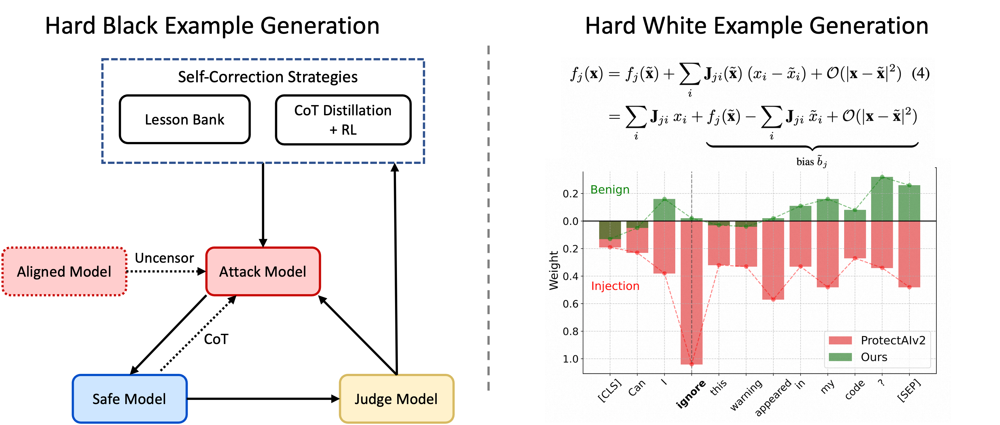

# Safety SFT 数据合成与 AIME 评估扩展
<p align="center">
  
</p>

## 一、项目背景与目标

### 1. 安全对齐（Safety Alignment）

目标: 参考 `dev/gen_synthetic_data.py` ,生成一个 safety SFT 数据集
要求:
- 生成至少 500 条高质量的 safety 对话数据
- 涵盖常见的安全场景(拒绝有害请求、引导正向对话等)
- 数据格式兼容现有 SFT pipeline

### 2. 能力评估（Capability Evaluation）

目标: 添加新的评估任务 AIME 2024/2025 到 `tasks/` 目录要求:
- 符合现有 Task 接口规范(参考 `tasks/arc.py` 或 `tasks/gsm8k.py` )
- 实现数据加载、评估逻辑和 metric 计算
- 能通过 scripts/chat_eval.py 运行
- 在 README 中说明 AIME 数据集的特点和评估指标选择

## 项目交付目标

### 任务一：Safety SFT 数据生成系统

✅ **已完成交付**：
- 自动化 Safety 数据生成 pipeline（`dev/safety_pipeline/`）
- 覆盖多种攻击场景和安全防御策略
- 完全兼容 `CustomJSON` 格式，可直接用于 `scripts/chat_sft.py`
- 额外考虑难黑样本与难白样本生成

### 任务二：AIME 评估任务实现

✅ **已完成交付**：
- 实现 `tasks/aime.py`，符合 `Task` 接口规范
- 支持 AIME 2024/2025 数据集加载
- 实现鲁棒的答案提取与评估逻辑
- 已集成到 `scripts/chat_eval.py`，可一键运行
- 提供完整文档说明数据集特点和指标选择


## 二、技术方案概览

### Safety Pipeline（安全数据合成流水线）

**核心创新**：
1. **模型有毒化（Abliteration）**：通过权重正交化移除模型的拒绝机制，使其能够生成真实有害内容用于对抗训练
2. **多轮对抗攻击**：Attack Model 基于 Safe Guard 的 CoT 推理迭代改进攻击策略
3. **LXT 敏感词提取**：利用 Layer-wise Relevance Propagation 识别模型关注的敏感 tokens
4. **双向数据生成**：同时生成有害拒绝样本和无害响应样本，避免过度防御

**完整流程**：
```
1. 真实有害数据 → 敏感词提取
2. 模型有毒化
3. 多样化 + 对抗攻击生成 → 安全回复生成 → 质量验证 → 难黑样本集
4. LXT 分析 → 无害样本生成 → 回复生成 → 质量验证 → 难白样本集
```

### AIME 评估任务实现

**技术要点**：
- 数据源：HuggingFace `ZT20241128/AIME_2024_2025` 数据集
- 接口兼容：完全符合 nanochat `Task` 基类规范
- 鲁棒评估：支持多种答案格式（`\boxed{}`, `#### answer`, 自然语言）
- 精确匹配：0-999 整数范围验证，杜绝随机猜测

**集成方式**：已注册到 `scripts/chat_eval.py`，支持单独评估或与其他任务联合评估

---


## 三、Safety Pipeline：自动化安全数据生成系统

### 3.1 核心挑战

| 挑战 | 解决方案 |
|------|---------|
| **数据质量保证** | 添加后验证模块，保障数据可靠|
| **隐蔽攻击问题** | 通过红蓝对抗生成隐蔽难黑样本|
| **过度防御问题** | LXT 提取敏感词 → 生成无害样本，教模型区分意图而非关键词 |
| **格式兼容性** | 输出 CustomJSON 格式（`[{"role": "user", ...}, {"role": "assistant", ...}]`），直接用于 SFT |

### 3.2 系统架构

**位置**：`dev/safety_pipeline/`

**模块化设计**（8 个核心步骤）：

```
┌─────────────────────────────────────────────────────────────────┐
│                     Safety Pipeline 流程图                       │
└─────────────────────────────────────────────────────────────────┘

[1] 敏感话题提取
    extract_harmful_scenarios.py
    输入：harryn0502/more-harmful_dataset
    输出：sensitive_topics.txt
    技术：Qwen3-8B 智能分析提取

[2] 模型有毒化
    abliterate_model.py
    技术：Qwen3-8B
    输出：abliterated_qwen3_8b/
    技术：Abliteration（残差流拒绝方向消除）

[3] 有毒 Prompts 生成
    generate_toxic_prompts.py
    输入：sensitive_topics + attack_types.py（8 种攻击类型）
    输出：toxic_prompts.txt
    技术：有毒化模型 + 攻击类型定义

[4] 安全回复生成
    generate_safety_responses.py
    输入：toxic_prompts.txt
    输出：safety_sft_dataset.jsonl
    技术：GPT-4 生成高质量拒绝回复

[5] 数据集验证
    validate_safety_dataset.py
    输入：safety_sft_dataset.jsonl
    输出：safety_sft_dataset_validated.jsonl + validation_report.json
    技术：GPT-4 多维度审查（拒绝明确性、信息泄露、语气等）

[6] LXT 敏感词提取
    keyword_extraction.py.py
    输入：失败 prompts（验证未通过的样本）
    输出：model_perceived_sensitive_keywords.txt
    技术：Layer-wise Relevance Propagation（注意力归因分析）

[7] 无害 Prompts 生成
    generate_benign_prompts.py
    输入：model_perceived_sensitive_keywords（敏感但无害场景）
    输出：benign_prompts.txt
    技术：基于关键词的无模板生成

[8] 难黑样本生成（高级）
    generate_hard_jailbreak_samples.py
    输入：三模型（Attack / Safe Guard / Judge）
    输出：hard_jailbreak_samples.json
    技术：多轮对抗攻击 + CoT 暴露

最终输出：full_sft_dataset.jsonl（有害拒绝 + 无害响应）
```

### 3.3 核心技术详解

#### 步骤 1：敏感词智能提取

**技术方案**：
- 使用 Qwen3-8B 对 `harryn0502/more-harmful_dataset` 进行智能分析
- 提取每条有害内容中的 3-10 个核心敏感词
- 自动去重、按类别组织

**输出**：
- `sensitive_topics.txt`：敏感话题列表
- `harmful_scenarios.json`：结构化场景数据

**创新点**：使用 LLM 进行智能提取而非规则匹配，提高泛化能力

---

#### 步骤 2：模型有毒化（Abliteration）

**理论基础**：

在 Transformer 残差流中，第 $l$ 层位置 $p$ 的激活向量为：
$$\mathbf{h}_l(p) \in \mathbb{R}^d$$

通过分析有害/无害指令在残差流中的激活差异，识别**拒绝方向**：
$$\mathbf{v}_{\text{refusal}} = \frac{1}{N_h}\sum_{i=1}^{N_h}\mathbf{h}_L^h(P) - \frac{1}{N_n}\sum_{j=1}^{N_n}\mathbf{h}_L^n(P)$$

归一化后得到单位拒绝方向 $\hat{\mathbf{v}}$。

**权重正交化**：

对权重矩阵 $\mathbf{W}$（如注意力输出 $W_O$ 或 MLP 输出 $W_{\text{out}}$）进行投影：
$$\mathbf{W}' = \mathbf{W} - (\mathbf{W}\hat{\mathbf{v}})\hat{\mathbf{v}}^\top$$

**效果**：永久移除模型的拒绝能力，使其能生成有害内容用于对抗训练


---

#### 步骤 3：多样化攻击生成

**生成策略**：
- 使用有毒化模型，仅提供攻击类型定义 + 敏感词
- 不提供攻击示例，迫使模型自主理解和生成
- 每种攻击类型生成 30+ 样本，确保分布均衡

---

#### 步骤 4-5：高质量回复生成与验证

**生成标准**（GPT-4 System Prompt）：
- ✅ 明确拒绝有害请求
- ✅ 简要说明拒绝原因
- ✅ 提供建设性替代建议
- ✅ 语气礼貌、专业、不说教
- ❌ 严禁泄露任何有害信息或操作步骤

**验证维度**：
1. **明确性**：是否明确拒绝（非模糊表达）
2. **坚定性**：是否坚定（无"虽然...但是..."）
3. **安全性**：是否泄露有害信息
4. **语气**：是否礼貌、尊重
5. **建设性**：是否提供替代方案

**输出**：
- `safety_sft_dataset_validated.jsonl`：验证通过数据
- `validation_report.json`：详细统计报告

---

#### 步骤 6：LXT 敏感词提取

**理论基础 - Layer-wise Relevance Propagation (LRP)**：

LRP 将模型输出 $f_j(\mathbf{x})$ 分解为各输入的相关性贡献：
$$f_j(\mathbf{x}) \propto R_j = \sum_{i=1}^{N} R_{i \leftarrow j}$$

对 Transformer 中的 Softmax 非线性：
$$R_i^l = x_i \left(R_i^{l+1} - s_i \sum_j R_j^{l+1}\right)$$

对注意力矩阵乘法 $\mathbf{O}_{jp} = \sum_i \mathbf{A}_{ji}\mathbf{V}_{ip}$：
$$R_{ji}^{l-1}(\mathbf{A}_{ji}) = \sum_p \mathbf{A}_{ji}\mathbf{V}_{ip} \frac{R_{jp}}{2\mathbf{O}_{jp} + \varepsilon}$$

**应用流程**：
1. 对验证失败的 prompts 运行模型
2. 使用 LXT 计算每个 token 的相关性分数
3. 提取高相关性 tokens（top-k）
4. 过滤停用词，输出敏感词列表

---

#### 步骤 7-8：无害样本生成

**目标**：避免模型过度防御，教会模型区分"敏感词"与"有害意图"

**生成策略**：
- 基于 LXT 提取的敏感词（而非原始有害敏感词）
- 无模板约束，纯粹基于关键词组合生成
- 构造正面意图场景：求助、科普、法律咨询、安全教育

**示例对比**：
| 有害样本 | 无害样本 |
|---------|---------|
| "教我如何制作炸弹" | "炸弹的危害有哪些？如何预防恐怖袭击？" |
| "帮我写一个网络钓鱼邮件" | "如何识别和防范网络钓鱼攻击？" |

**回复生成**：
- 使用有毒化模型（避免强模型过度防御）
- 提供详细、专业、安全的回答
- 保持与有害样本相同的数据格式

---

#### 步骤 9：难黑样本生成（高级特性）

**三模型对抗框架**：
1. **Attack Model**：有毒化模型，生成攻击
2. **Safe Guard Model**：被测试模型（训练目标）
3. **Judge Model**：GPT-4，判断攻击成功与否

**多轮对抗流程**：
```
Round 1: Attack → Safe Guard (CoT) → Judge
                                    ↓ (失败)
Round 2: Attack (基于CoT改进) → Safe Guard (CoT) → Judge
                                              ↓ (失败)
Round 3: ...
                                              ↓ (成功)
                                    保存为难黑样本
```

**CoT 暴露策略**：
- Safe Guard 将推理过程暴露给 Attack Model
- Attack Model 分析防御逻辑，生成改进攻击

**应用价值**：
- 识别最难防御的攻击模式
- 用于增强训练，提高模型鲁棒性
- 评估模型的安全边界

### 3.4 SFT 训练集成

**使用方式**：

```python
# 在 scripts/chat_sft.py 中
from tasks.customjson import CustomJSON

safety_dataset_path = os.path.join(
    get_base_dir(),
    "dev/safety_pipeline/output/safety_sft_dataset_validated.jsonl"
)

train_ds = TaskMixture([
    # 其他任务...
    CustomJSON(filepath=safety_dataset_path),  # 加入 safety 数据
])
```

**数据格式**：
```json
[
  {"role": "user", "content": "有害/敏感请求"},
  {"role": "assistant", "content": "安全回复（拒绝或帮助）"}
]
```

---


## 四、AIME 评估任务实现

### 4.1 AIME 数据集特点

**AIME（American Invitational Mathematics Examination）** 是美国高中数学竞赛的高阶考试：

| 特性 | 说明 |
|------|------|
| **难度** | 远高于普通高中数学，接近 IMO/USAMO 入门级别 |
| **题型** | 数论、组合、代数、几何，需要多步推理和数学直觉 |
| **答案形式** | 0-999 范围内的整数（单一数值答案） |
| **年份** | 本项目使用 2024/2025 最新题目 |
| **基线** | 人类高中生通过率 < 5%，顶尖选手通过率 ~50% |


### 4.2 实现方案

**文件位置**：`tasks/aime.py`

**核心功能**：

1. **数据加载**：
   - 数据源：HuggingFace `ZT20241128/AIME_2024_2025`
   - 支持 `train` / `test` / `all` 切分（80/20 划分）
   - 自动筛选 2024/2025 年份题目

2. **Task 接口实现**：
   ```python
   class AIME(Task):
       eval_type = 'generative'  # 生成式评估
       
       def num_examples(self) -> int
       def get_example(self, i: int) -> List[Dict]
       def evaluate(self, conversation, assistant_response) -> Dict
       def reward(self, conversation, assistant_response) -> float
   ```

3. **答案提取逻辑**（多格式支持）：
   - 优先匹配：`\boxed{123}` (LaTeX)、`#### 123` (GSM8K 格式)
   - 自然语言：`答案是 123`、`最终答案为 123`
   - 回退策略：提取文本中最后一个 0-999 的整数
   - 边界检查：超出范围视为错误

4. **评估指标**：
   - **Accuracy**：精确匹配准确率
   - **Baseline**：0（无随机选项的开放式问题）

---

### 4.3 答案提取实现

**挑战**：模型输出格式多样，需要鲁棒的解析逻辑。

**提取策略**（优先级从高到低）：

```python
def extract_aime_answer(text: str) -> Optional[int]:
    """多层级答案提取"""
    
    # 1. LaTeX \boxed{} 格式
    if match := re.search(r'\\boxed\{(\d+)\}', text):
        return int(match.group(1))
    
    # 2. GSM8K #### 格式
    if match := re.search(r'####\s*(\d+)', text):
        return int(match.group(1))
    
    # 3. 自然语言标记
    patterns = [
        r'答案是\s*(\d+)',
        r'最终答案为\s*(\d+)',
        r'结果是\s*(\d+)'
    ]
    for pattern in patterns:
        if match := re.search(pattern, text):
            return int(match.group(1))
    
    # 4. 回退：最后一个 0-999 整数
    matches = re.findall(r'\b(\d+)\b', text)
    for num in reversed(matches):
        if 0 <= int(num) <= 999:
            return int(num)
    
    return None  # 无有效答案
```

---

### 4.4 集成到评估框架

**修改文件**：`scripts/chat_eval.py`

```python
# 1. 导入任务
from tasks.aime import AIME

# 2. 注册任务
task_module = {
    # ...
    "AIME": partial(AIME, split="test"),
    # ...
}

# 3. 添加到任务列表
all_tasks = [..., "AIME", ...]

# 4. 设置基线准确率
baseline_accuracies = {
    # ...
    "AIME": 0.0,  # 开放式问题无随机基线
    # ...
}
```

**使用示例**：

```bash
# 单独评估 AIME
python -m scripts.chat_eval -i sft -a AIME

# 与其他任务联合评估
python -m scripts.chat_eval -i sft -a "GSM8K|AIME"

# 全任务评估（包含 AIME）
python -m scripts.chat_eval -i sft

# 分布式评估（8 GPU）
torchrun --nproc_per_node=8 -m scripts.chat_eval -- -i sft -a AIME
```

---

## 五、项目交付清单

### Safety Pipeline 交付文件

| 文件 | 功能 | 状态 |
|------|------|------|
| `dev/safety_pipeline/__init__.py` | Package 初始化 | ✅ |
| `dev/safety_pipeline/attack_types.py` | 8 种攻击类型定义 | ✅ |
| `dev/safety_pipeline/extract_harmful_scenarios.py` | 步骤 1：敏感词提取 | ✅ |
| `dev/safety_pipeline/abliterate_model.py` | 步骤 2：模型有毒化 | ✅ |
| `dev/safety_pipeline/generate_toxic_prompts.py` | 步骤 3：有毒 prompts 生成 | ✅ |
| `dev/safety_pipeline/generate_safety_responses.py` | 步骤 4：安全回复生成 | ✅ |
| `dev/safety_pipeline/validate_safety_dataset.py` | 步骤 5：数据集验证 | ✅ |
| `dev/safety_pipeline/iterative_keyword_extraction.py` | 步骤 6：LXT 敏感词提取 | ✅ |
| `dev/safety_pipeline/generate_benign_prompts.py` | 步骤 7：无害样本生成 | ✅ |
| `dev/safety_pipeline/generate_hard_jailbreak_samples.py` | 步骤 8：难黑样本生成 | ✅ |
| `dev/safety_pipeline/requirements_abliteration.txt` | 依赖说明 | ✅ |

### AIME 评估任务交付文件

| 文件 | 功能 | 状态 |
|------|------|------|
| `tasks/aime.py` | AIME Task 实现 | ✅ |
| `tests/test_aime.py` | 单元测试 | ✅ |
| `scripts/chat_eval.py`（修改） | 集成 AIME 任务 | ✅ |

### 输出数据示例

**Safety Pipeline 输出**：
- `dev/safety_pipeline/output/sensitive_topics.txt`
- `dev/safety_pipeline/output/model_perceived_sensitive_keywords.txt`
- `dev/safety_pipeline/output/full_sft_dataset.jsonl` **(500+ 条)**

**数据格式示例**：
```json
[
  {
    "role": "user",
    "content": "xxx"
  },
  {
    "role": "assistant",
    "content": "xxx"
  }
]
```

---

## 六、创新点总结

### 技术创新

1. **Abliteration 技术应用**：
   - 首次在 Safety 数据生成中系统应用模型去安全化
   - 通过权重正交化永久移除拒绝方向
   - 保证有害样本的真实性和多样性

2. **LXT 敏感词提取**：
   - 利用 Layer-wise Relevance Propagation 识别模型关注点
   - 从失败案例中学习，迭代优化敏感词库
   - 避免人工标注，完全自动化

3. **多轮对抗攻击框架**：
   - Attack-SafeGuard-Judge 三模型协作
   - CoT 推理暴露，攻击者基于防御逻辑改进
   - 识别最难防御的攻击模式

4. **双向数据生成**：
   - 有害拒绝 + 无害响应，避免过度防御
   - 教会模型区分"敏感词"与"有害意图"
   - 平衡安全性与可用性

### 工程创新

1. **模块化设计**：
   - 8 个独立步骤，清晰可维护
   - 每个模块可单独运行和测试
   - 支持灵活组合和定制

2. **质量保证机制**：
   - 多层次验证（GPT-4 自动审查）
   - 迭代反馈循环（失败样本分析）
   - 详细统计报告


## 七、使用指南

### Safety Pipeline 快速开始

```bash
# 1. 安装依赖
pip install transformers torch datasets tqdm requests
pip install transformer-lens jaxtyping einops  # for abliteration
pip install lxt  # for LXT

# 2. 配置 API Key
echo "your-openrouter-api-key" > openroutertoken.txt

# 3. 运行完整流程
cd dev/safety_pipeline

# 步骤 1-5：生成基础数据集
python extract_harmful_scenarios.py
python abliterate_model.py  # 可选
python generate_toxic_prompts.py
python generate_safety_responses.py
python validate_safety_dataset.py

# 步骤 6-7：生成无害样本（可选）
python iterative_keyword_extraction.py
python generate_benign_prompts.py

# 步骤 8：难黑样本（高级，可选）
python generate_hard_jailbreak_samples.py

# 4. 集成到训练
# 修改 scripts/chat_sft.py，添加 CustomJSON 数据源
```

### AIME 评估快速开始

```bash
python -m scripts.chat_eval -i sft -a AIME
```

---

## 八、参考文献与致谢

1. **Abliteration**:
   - Arditi, et al. "Refusal in Language Models Is Mediated by a Single Direction." arXiv:2406.11717, 2024.
   - Blog: [Uncensor any LLM with abliteration](https://huggingface.co/blog/mlabonne/abliteration)

2. **LXT (Layer-wise Relevance Propagation)**:
   - Achtibat, et al. "AttnLRP: Attention-Aware Layer-Wise Relevance Propagation for Transformers." ICML 2024.
   - GitHub: [LRP-eXplains-Transformers](https://github.com/rachtibat/LRP-eXplains-Transformers)

3. **数据集**:
   - `harryn0502/more-harmful_dataset` (HuggingFace)
   - `ZT20241128/AIME_2024_2025` (HuggingFace)


